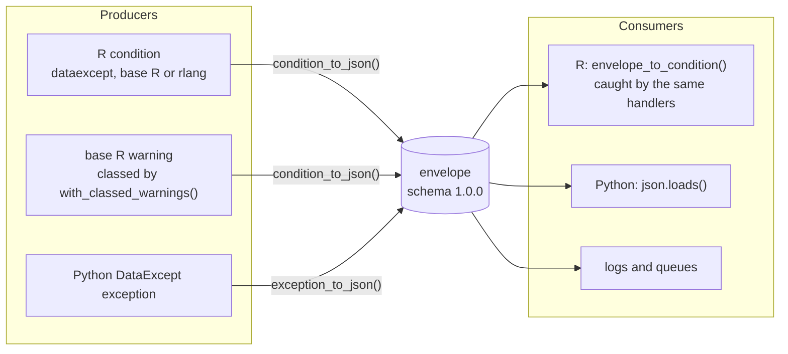

# Architecture

dataexcept has one external contract, the envelope schema, and everything in
the package either produces envelopes, consumes them, or prepares conditions
for them.

Failure events add an operation context to the envelope, OpenTelemetry
attributes project the same envelope onto a span, and the Pino profile
projects it onto the error a Node.js logger expects; see
[Observability](guide/observability.md) and [Logging for Pino](guide/pino.md).
None of them changes the envelope.

## A condition, inside

A dataexcept condition is a plain R condition, a list with a class vector:

| Element | Holds |
| --- | --- |
| `message`, `call` | What every R condition holds. The message is redacted at construction. |
| named fields | The constructor's arguments (`column`, `iterations`, `endpoint` ...), read with `$`. |
| `parent` | The cause, or `NULL`. rlang uses the same field. |
| `.dataexcept` | Internal state: the envelope `type` and `module`, the failure metadata and, for a condition read from an envelope, the verbatim attributes, context and group members. |

The class vector is the envelope type's R class followed by its ancestors, then
`error` (or `warning`) and `condition`. Classes are named `dataexcept_` plus
the snake_case form of the type: `MissingColumnError` is
`dataexcept_missing_column_error`. Leaf types match the Python package's names.

## Writing an envelope

`condition_to_envelope()` walks the condition and its `parent` chain, one
record per condition, up to `max_depth`:

1. Identity: `type`, `module` and `message`.
2. `failure`, for a dataexcept error, or a condition read from an envelope that
   had one.
3. `attributes`: the fields, made JSON-safe by degrading anything JSON cannot
   hold to a description of itself.
4. `exceptions`, `cause` and `context`, recursively.

Keys are written in the same order as the Python serializer, numbers to the
shortest precision that round-trips, and every string passes through
redaction. The JSON writer is the package's own, so every formatting decision
is explicit; jsonlite is used only for parsing.

## Reading an envelope

`envelope_to_condition()` validates the payload, then rebuilds each node. A
node from a DataExcept module gets the R classes of its type, or the root
`dataexcept_error` when R has no class for it, and a node with an
`exceptions` array, whatever its type, gets `dataexcept_condition_group`. The node's attributes are kept
verbatim alongside the fields made from them, so writing the condition back
reproduces the original record, including the cycle and truncation markers,
exception groups and implicit context that R conditions have no equivalent
for.

## Keeping in step with Python

The Python package owns the contract. Six checks keep the R side on it:

| Check | Where |
| --- | --- |
| Every reference fixture the Python package generates from its own serializer reads into R and writes back unchanged. | `tests/testthat/test-envelope-write.R` |
| Redaction gives the Python implementation's exact output on a set of awkward URLs. | `tests/testthat/test-redaction.R` |
| `validate_envelope()` agrees with a JSON Schema validator on valid and invalid payloads. | `tests/testthat/test-validation.R` |
| Every condition type R shares with Python, built with the same arguments, has the Python class's type, message, failure metadata and attributes. | `tests/testthat/test-constructor-parity.R` |
| Every reference envelope projects to the Python package's Pino record exactly. | `tests/testthat/test-pino.R` |
| Every envelope R writes, and its Pino projection, validates against its schema under Python's `jsonschema`; weekly, the fixtures are regenerated from DataExcept's `main` branch and the job fails if anything moved. | `.github/workflows/envelope-contract.yml` |

The fixtures and parity cases are regenerated with
`tools/generate-test-fixtures.py`; see [Development](development.md).
